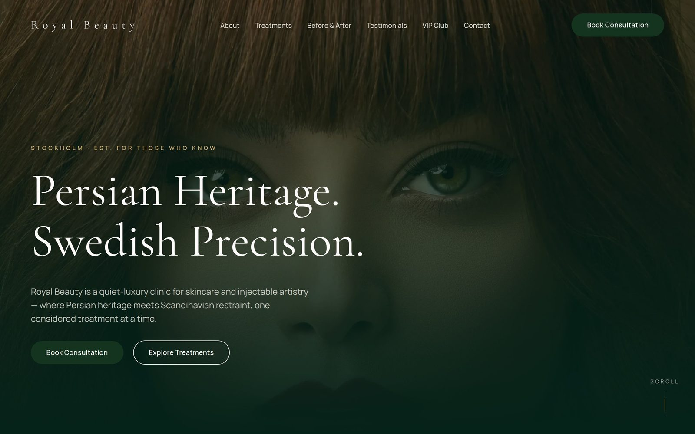
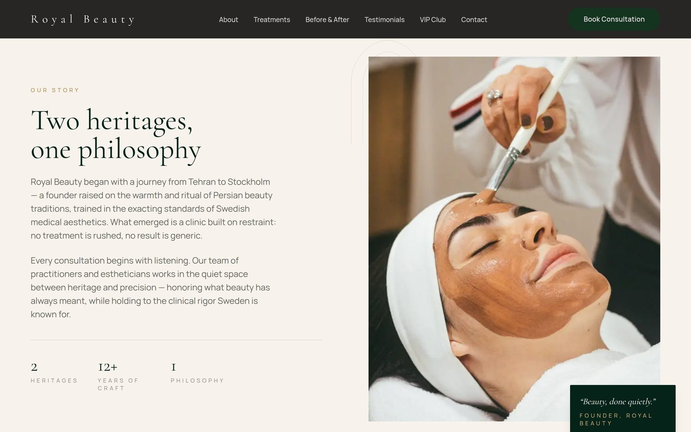
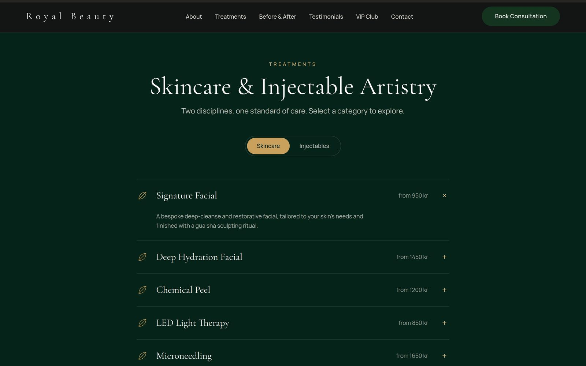
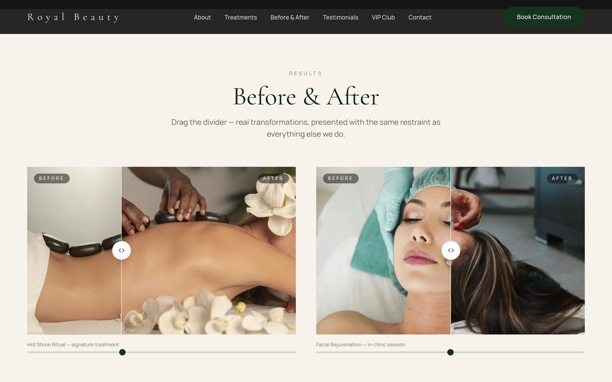
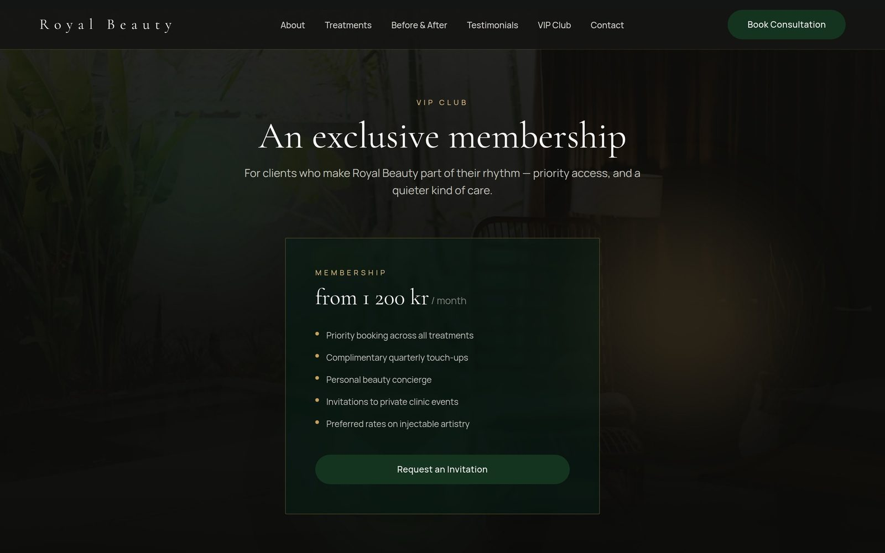
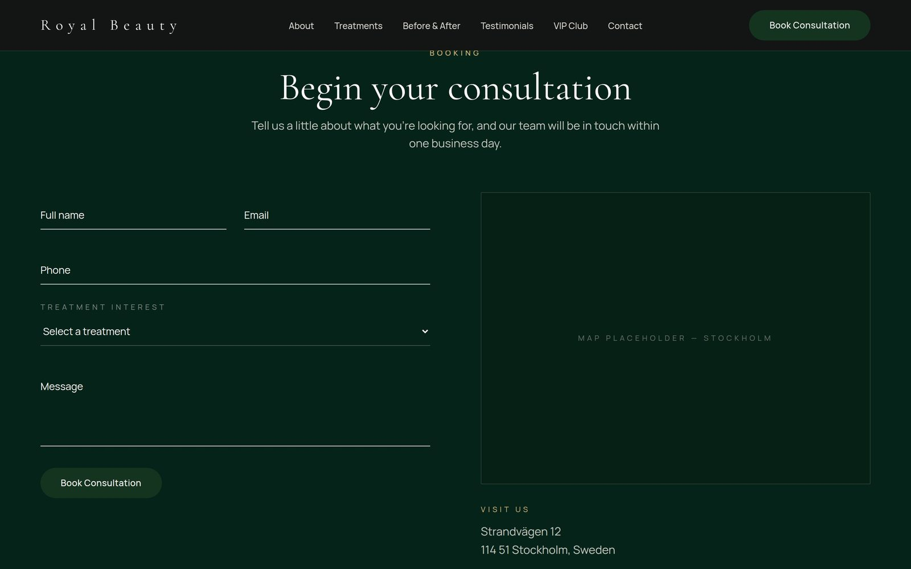
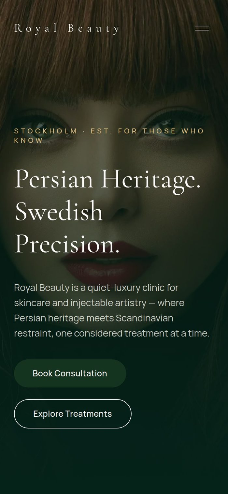
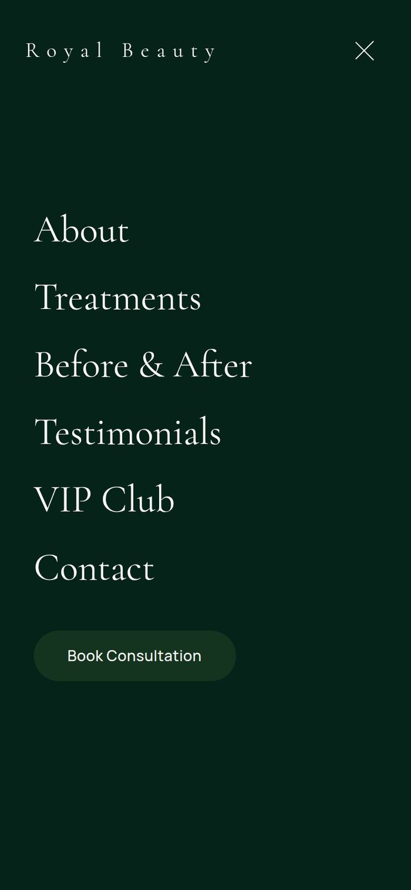

# Royal Beauty

A frontend-only marketing site for Royal Beauty, a luxury Iranian-Swedish beauty
clinic in Stockholm. Cinematic, editorial, quiet-luxury design — no backend,
no database; the booking form is a client-side UI stub only.



## Screenshots

<table>
  <tr>
    <td width="50%"></td>
    <td width="50%"></td>
  </tr>
  <tr>
    <td width="50%"></td>
    <td width="50%"></td>
  </tr>
  <tr>
    <td width="50%"></td>
    <td width="50%">
      
      
    </td>
  </tr>
</table>

## Stack

- **Next.js 14** (App Router) + TypeScript
- **Tailwind CSS** for the design system (`tailwind.config.ts`)
- **Framer Motion** for component/page animation
- **GSAP + ScrollTrigger** for scroll-driven parallax
- **Lenis** for smooth scrolling, synced to GSAP's ticker
- `next/font` (Cormorant Garamond + Manrope) and `next/image`, with real
  photography self-hosted in `public/images` (free Unsplash License)

## Getting started

```bash
npm install
npm run dev
```

Open [http://localhost:3000](http://localhost:3000).

## Project structure

```
src/
  app/            # layout, page, global styles
  components/
    layout/       # Nav, MobileMenu, Footer, Preloader, SmoothScrollProvider, CustomCursor
    sections/     # Hero, About, Treatments, Before/After, Testimonials, Membership, Contact
    ui/           # Button, SectionHeading, RevealText, ScrollCue, PersianMotif, CompareSlider, ...
  lib/            # shared motion variants, hooks, constants, content data
  types/          # shared content types
public/
  images/         # self-hosted photography
docs/
  screenshots/    # images used in this README
```

## Status

All sections are built with their own animation treatment: staggered headline
reveal and GSAP parallax on the Hero, a scroll-triggered clip-path image
reveal on About, an animated category toggle + accordion on Treatments, a
draggable before/after comparison slider, an auto-advancing testimonial
carousel, an ambient animated background on the VIP Club section, and a
floating-label booking form on Contact that logs to the console and shows a
success state — no backend involved.

The nav shrinks and solidifies on scroll, with a slide-in mobile menu; a
branded preloader and a desktop-only custom cursor round out the shell.

All motion respects `prefers-reduced-motion` (via `MotionConfig` and
per-component checks for GSAP/Lenis/cursor/preloader). The scrollbar is
themed to match the site's emerald/gold/ivory palette.
